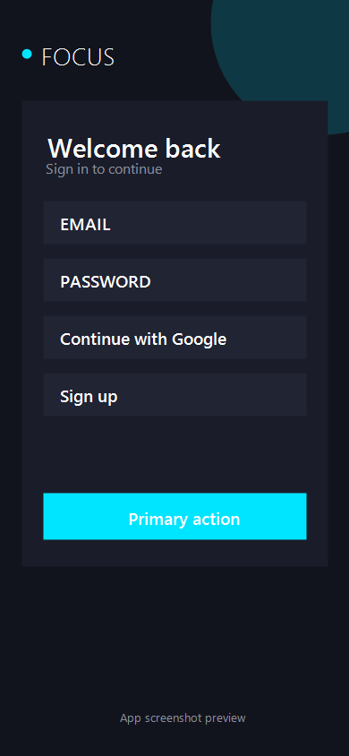
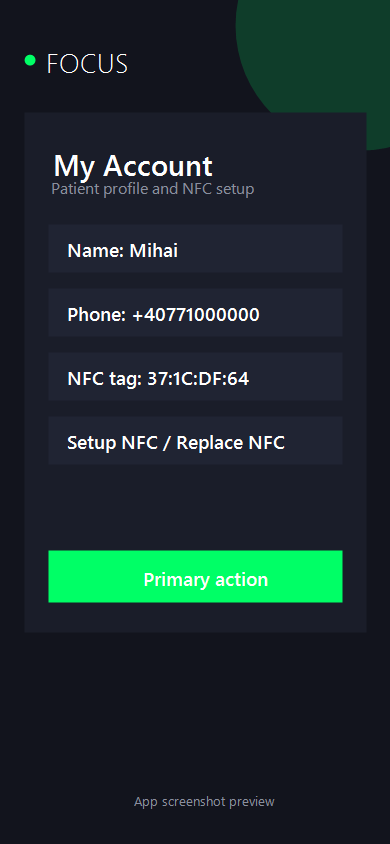
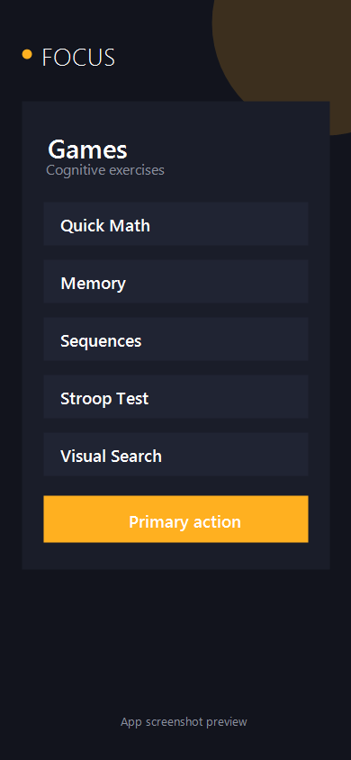

# FocusUserApp

FocusUserApp is an Android patient-facing application for authentication, profile management, medical test result viewing, NFC patient tag setup, and quick cognitive games. The app stores patient data and activity results in Firebase Realtime Database and uses Firebase Authentication with email/password and Google Sign-In.

## Screenshots

| Login | Profile + NFC | Games |
| --- | --- | --- |
|  |  |  |

## Main Features

- Email/password authentication.
- Google Sign-In authentication.
- Patient profile setup after account creation.
- Profile screen with name, email, phone, birth date, and NFC tag.
- NFC setup flow that writes the scanned tag ID to `patients/{patientId}/nfc` in Firebase Realtime Database.
- Confirmation dialog before replacing an existing NFC tag.
- Medical test result history with ECG, SpO2, map, distance, duration, and Go/No-Go accuracy.
- Cognitive games:
  - Quick Math
  - Memory
  - Sequences
  - Stroop Test
  - Visual Search
- Game result saving to Firebase.
- App settings screen with theme and language controls.
- Dark/light appearance system.
- Multi-language text system for English, Romanian, and Turkish.

## Technologies Used

### Core

- Kotlin `2.1.0`
- Android Gradle Plugin `8.12.3`
- Gradle Kotlin DSL
- Kotlin Multiplatform project structure
- Android SDK:
  - `minSdk 24`
  - `targetSdk 36`
  - `compileSdk 36`
- Java/JVM target `11`

### Android UI

- Android Views/XML layouts
- AppCompat `1.7.0`
- ConstraintLayout `2.1.4`
- CardView `1.0.0`
- Material Components `1.12.0`
- Custom Android `View` classes:
  - `LineChartView`
  - `GridMapView`
- Programmatic UI screens for games and settings.
- Custom theme/palette handling through `AppAppearance`.

### Compose Dependencies

The project includes Compose dependencies and tooling:

- AndroidX Activity Compose
- Compose BOM `2024.09.00`
- Compose UI
- Compose UI Graphics
- Compose Material 3
- Compose tooling and testing artifacts

The current visible app screens are primarily implemented with Android Views and XML/programmatic UI.

### Firebase

- Firebase Authentication
- Firebase Realtime Database
- Firebase BoM `33.1.0`
- Google Services Gradle Plugin `4.4.4`

Firebase is used for:

- User authentication.
- Patient profile storage.
- Test result storage.
- Game/activity result storage.
- NFC tag storage.

### Google Sign-In

- Google Play Services Auth `21.2.0`
- Google Identity library
- `default_web_client_id` configured in `res/values/strings.xml`

### Device Features

- NFC reader support through Android `NfcAdapter`.
- Optional NFC hardware declaration:

```xml
<uses-feature
    android:name="android.hardware.nfc"
    android:required="false" />
```

### Testing Dependencies

- JUnit `4.13.2`
- AndroidX JUnit
- Espresso
- Compose UI test libraries

## Project Structure

```text
FocusUserApp/
├── app/
│   ├── src/
│   │   ├── commonMain/kotlin/com/example/focususerapp/
│   │   │   └── PatientModels.kt
│   │   └── main/
│   │       ├── java/com/example/focususerapp/
│   │       │   ├── LoginActivity.kt
│   │       │   ├── SignUpActivity.kt
│   │       │   ├── SetupProfileActivity.kt
│   │       │   ├── MainActivity.kt
│   │       │   ├── GamesActivity.kt
│   │       │   ├── SettingsActivity.kt
│   │       │   ├── PatientRepository.kt
│   │       │   ├── AppAppearance.kt
│   │       │   ├── AppSettings.kt
│   │       │   ├── AppText.kt
│   │       │   ├── LineChartView.kt
│   │       │   └── GridMapView.kt
│   │       ├── res/
│   │       └── AndroidManifest.xml
├── docs/
│   └── screenshots/
├── gradle/
├── build.gradle.kts
├── settings.gradle.kts
└── README.md
```

## Firebase Data Shape

The app expects patient data under:

```text
patients/{uid}
```

Important fields include:

```text
patients/{uid}/name
patients/{uid}/surname
patients/{uid}/email
patients/{uid}/phone
patients/{uid}/birthDate
patients/{uid}/setup
patients/{uid}/nfc
patients/{uid}/testResults
patients/{uid}/activityResults
```

When an NFC tag is scanned, the app saves the tag ID here:

```text
patients/{uid}/nfc
```

## NFC Flow

1. Open the profile screen.
2. Press `Setup NFC` if no tag exists.
3. If a tag already exists, press `Replace NFC`.
4. Confirm the replacement.
5. Hold the NFC tag close to the phone.
6. The app reads the tag ID and writes it to Firebase.

The tag is stored as an uppercase hexadecimal string.

## Cognitive Games

### Quick Math

Timed arithmetic challenge. The player solves as many operations as possible in 60 seconds.

### Memory

Card matching game with different board sizes based on difficulty.

### Sequences

Simon-style sequence memory game. The sequence is shown with high-contrast flashes, numbered tiles, haptic feedback, and increasing length.

### Stroop Test

The user must select the ink color, not the word text.

### Visual Search

The user finds the odd character among similar-looking symbols before time runs out.

## Localization

The app uses a custom text localization object:

```text
AppText.kt
```

Supported languages:

- English
- Romanian
- Turkish

Language and theme preferences are stored through:

```text
AppSettings.kt
```

## Performance Notes

The app includes optimizations for smoother usage:

- Firebase game history is limited to the latest results.
- Chart and map data are downsampled before rendering.
- Custom chart/map views cache paths and coordinates.
- Heavy software shadows were removed from draw loops.
- Visual Search uses lightweight clickable text cells.
- Settings updates rebuild the current UI instead of restarting the entire activity.

## Requirements

- Android Studio
- JDK 11 or newer
- Android SDK 36
- Firebase project with Authentication and Realtime Database enabled
- `google-services.json` configured for the app
- NFC-capable phone for NFC setup/testing

## Build

From the project root:

```powershell
.\gradlew.bat assembleDebug
```

If your system Java is older than Java 11, use Android Studio's bundled JBR:

```powershell
$env:JAVA_HOME='C:\Program Files\Android\Android Studio\jbr'
$env:PATH="$env:JAVA_HOME\bin;$env:PATH"
.\gradlew.bat assembleDebug
```

## Run

1. Open the project in Android Studio.
2. Sync Gradle.
3. Make sure Firebase is configured.
4. Select a device or emulator.
5. Press Run.

For NFC testing, use a real Android device with NFC enabled.

## Notes

- The app uses Firebase Realtime Database paths under `patients/{uid}`.
- NFC hardware is optional in the manifest, so the app can still install on devices without NFC.
- NFC setup will show a message if NFC is unavailable or disabled.
