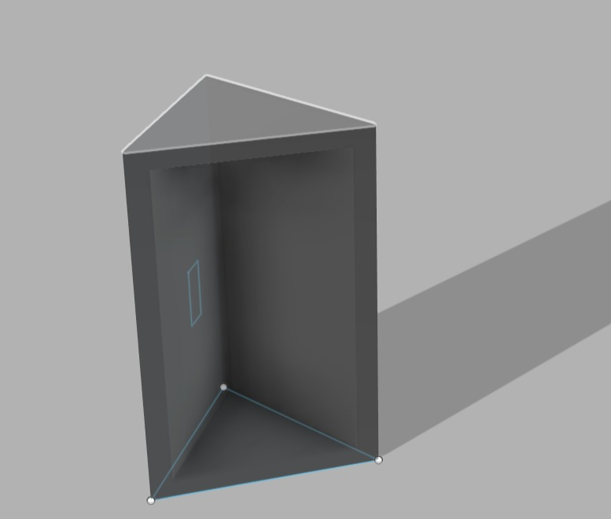
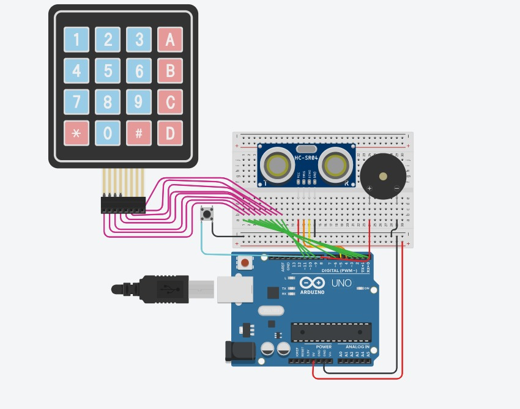
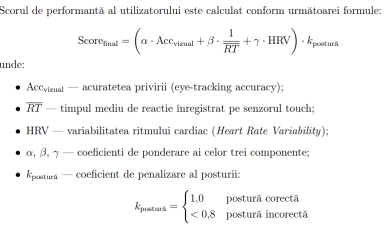

# Fișa de înscriere a proiectului

## 1. Date de identificare

- **Titlul proiectului şi acronimul:** F.O.C.U.S AI
- **Categorie:** Seniori
- **Secțiune:** Tehnologia Informației
- **Mentorul echipei:** prof. Apostol Valeriu, Liceul cu Program Sportiv Galați / Centrul Județean de Excelență Galați, secțiunea Robotică, 0764273636
- **Echipa de proiect:**
  - Condrici Mihai (clasa a X-a, Colegiul Național „Vasile Alecsandri" Galați / Centrul Județean de Excelență Galați, secțiunile C++, C#, Robotică) - realizator al aplicației WPF și modului Hardware
  - Pătrașc Matteo (clasa a X-a, Colegiul Național „Costache Negri" Galați / Centrul Județean de Excelență Galați, secțiunile C++, C#, Robotică) - realizator al modului AI Python
- **Colaboratori/parteneri:**
  - prof. Dinu Elena, Colegiul Național „Costache Negri" Galați / Centrul Județean de Excelență Galați, secțiunile C++, C#
  - prof. Panaite Daniela, Colegiul Național „Costache Negri" Galați, Biologie
  - dr. Sevastian Emanuiela, medic specialist în neurologie pediatrică, Spitalul de Urgență pentru Copii "Sfântul Ioan" Galați
  - Sorana Mocanu, psiholog

## 2. Rezumatul proiectului

> Proiectul F.O.C.U.S. AI propune o stație neuro-cognitivă bimodală de ultimă generație, concepută pentru a măsura, analiza și antrena capacitatea de concentrare umană într-un context digital tot mai fragmentat. În centrul inovației noastre se află tranziția de la evaluările psihologice subiective la o diagnoză bazată pe date biometrice și vizuale colectate în timp real.
>
> Sistemul este construit pe o infrastructură hardware robustă, utilizând un mini PC Lenovo ThinkCenter neo 50q Gen 4 ce rulează Windows 11, echipat cu un sistem dual-monitor portabil YoDoIt de 16.5 inch. Această configurație permite o separare clară a fluxurilor de lucru: un monitor este dedicat pacientului (pentru teste și stimuli vizuali generați software), iar celălalt medicului/specialistului (pentru monitorizarea parametrilor ECG, hărților de căldură ale privirii și gestionarea sesiunii).
>
> Integrarea senzoristică este realizată prin intermediul unui microcontroler Arduino Uno, care gestionează un senzor de touch (pentru timpi de reacție), un buzzer (stimuli auditivi), un pulsoximetru și un shield ECG MyoWare (stres fiziologic). Securitatea accesului este garantată printr-un sistem hibrid de autentificare: card NFC urmat de un cod PIN secret introdus pe un NumPad fizic.
>
> Datele colectate sunt procesate de un algoritm de fuziune matematică pentru a genera un „Indice de Concentrare" și sunt stocate în Firebase Realtime Database. În premieră, am implementat un algoritm de predictibilitate a progresului, care analizează tendințele cognitive pe termen lung. Pacienții își pot urmări evoluția prin intermediul unei aplicații mobile dedicate, dezvoltată în Kotlin Multiplatform, asigurând accesibilitatea pe orice dispozitiv (Android/iOS).

## 3. Descriere detaliată a proiectului

### a. Scop

Scopul proiectului F.O.C.U.S. AI este dezvoltarea unei platforme hibride avansate (Hardware-Software) destinate evaluării, analizei și antrenării capacității de concentrare umană. Într-un context global definit de „economia atenției" și fragmentarea cognitivă cauzată de mediile digitale suprastimulante, proiectul își propune să ofere o stație de diagnoză obiectivă. Prin combinarea analizei vizuale computerizate (AI) cu date biometrice (ECG, pulsoximetru), posturologie și reacții neuromotorii (touch), sistemul transformă datele brute într-un profil cognitiv complet, oferind în același timp instrumente de reeducare prin exerciții interactive.

### b. Obiective

i. **Integrarea unei infrastructuri de calcul performante:** Utilizarea unui mini PC Lenovo ThinkCenter neo 50q Gen 4 și a unui sistem de afișare dual-monitor (YoDoIt 16.5") pentru a separa interfața pacientului de cea a specialistului.

ii. **Dezvoltarea unui modul de monitorizare vizuală:** Implementarea unui algoritm de eye-tracking în Python (OpenCV/dlib) capabil să ruleze la minimum 30 FPS pentru detectarea precisă a atenției.

iii. **Construcția modulului hardware de achiziție:** Utilizarea unui microcontroler Arduino Uno pentru gestionarea senzorilor de touch, buzzer-ului, pulsoximetrului și a shield-ului ECG MyoWare.

iv. **Securizarea datelor și autentificarea:** Implementarea unui sistem de acces hibrid bazat pe carduri NFC și validare prin cod PIN introdus pe un NumPad fizic.

v. **Extinderea ecosistemului în Cloud și Mobile:** Sincronizarea datelor prin Firebase și dezvoltarea unei aplicații mobile cross-platform folosind Kotlin Multiplatform (KMP).

vi. **Modelarea matematică a performanței:** Crearea unui algoritm de predicție a progresului cognitiv bazat pe analiza trendurilor istorice.

### c. Problema identificată și studiul de piață

**Problema identificată:** Mediul digital contemporan, dominat de conținut de tip „short-form" (TikTok, Reels), antrenează creierul pentru recompense rapide și atenție de scurtă durată. Acest fenomen duce la o degradare a concentrării profunde și la creșterea ratelor de ADHD indus digital. Metodele clasice de evaluare (chestionarele) sunt subiective, iar pacienții nu pot identifica momentul exact în care atenția lor colapsează.

**Studiul de piață:** Soluțiile profesionale de eye-tracking (ex. Tobii) sunt extrem de costisitoare (mii de euro) și se concentrează strict pe privire, ignorând starea fiziologică sau postura. Dispozitivele clinice ECG sunt voluminoase și nu sunt integrate în platforme de antrenament cognitiv. F.O.C.U.S. AI ocupă această nișă, oferind o soluție portabilă, accesibilă și integrată, care corelează privirea cu stresul cardiac și postura corporală într-un singur „Indice de Concentrare".

### d. Etapele parcurse

i. **Cercetare și Design (Septembrie - Noiembrie 2025):** Studiul impactului stimulilor asupra HRV (Heart Rate Variability) și proiectarea arhitecturii sistemului dual-monitor.

ii. **Dezvoltare AI și Backend (Decembrie 2025 - Ianuarie 2026):** Antrenarea algoritmului de landmark detection și configurarea bazei de date Firebase.

iii. **Prototipare Hardware (Februarie - Martie 2026):** Integrarea senzorului de touch, a buzzer-ului și a cititorului NFC.

iv. **Integrare și UI/UX (Aprilie 2026):** Dezvoltarea interfeței WPF în C# și a logicii de comunicare serială. Crearea aplicației mobile în Kotlin Multiplatform.

v. **Validare și Calibrare (Mai 2026):** Testarea sistemului pe eșantioane de control și ajustarea algoritmului de predicție a progresului.

### e. Metode folosite, descrierea sistemului realizat și organizarea studiilor

Sistemul este fundamentat pe o arhitectură *Edge-to-Cloud* compusă din:

#### i. Dezvoltare monitorizare vizuală (AI Python)

Modulul de AI funcționează ca un „ochi digital" care analizează comportamentul utilizatorului fără a necesita senzori invazivi.

- **Tehnologie:** Folosim Python cu librăriile opencv-python pentru procesare video și dlib pentru extragerea celor 68 de puncte faciale (landmarks).
- **Funcționalitate:** Algoritmul identifică zona ochilor și calculează unghiul privirii (gaze estimation) în timp real. Sistemul poate detecta dacă utilizatorul privește stimulul generat pe ecran sau dacă este distras de mediu. De asemenea, monitorizează frecvența clipitului (blink rate) ca indicator al oboselii oculare.

#### ii. Dezvoltare Hardware (Arduino UNO R3)

Nucleul fizic este bazat pe **Arduino Uno**, ales pentru stabilitatea sa în aplicații de timp real.

- **Stimuli și Reacție:** Stimulii vizuali sunt generați software pe monitorul YoDoIt, iar cei auditivi prin **buzzer**. Reacția este captată instantaneu de un **senzor de touch**, eliminând erorile mecanice.
- **Monitorizarea Posturii:** Un **senzor** verifică distanța utilizatorului față de monitor. Dacă acesta se apleacă prea mult (stres) sau se retrage (lipsă de interes), sistemul invalidează datele.
- **Biometrie:** Shield-ul **MyoWare ECG** înregistrează activitatea cardiacă, permițând corelarea momentelor de efort cognitiv cu variațiile pulsului.
- **Securitate:** Cititorul **NFC** solicită un card valid, după care utilizatorul trebuie să introducă un PIN pe un **NumPad** fizic conectat, asigurând un mediu de testare securizat pentru datele sensibile.

#### iii. Dezvoltare UI/UX Desktop (WPF, C#)

Aplicația principală este dezvoltată în **WPF (C#)**, rulând pe **Lenovo ThinkCenter neo 50q**.

- **Dual-Monitor Workflow:**
  - *Monitorul 1 (Pacient):* Afișează o interfață curată, unde apar testele cognitive și jocurile.
  - *Monitorul 2 (Doctor):* Afișează dashboard-ul de control, graficele biometrice LiveCharts și feed-ul video cu datele de eye-tracking suprapuse.
- **Arhitectură:** Implementăm pattern-ul MVVM pentru o separare clară a logicii de prezentare, facilitând scalabilitatea proiectului.

#### iv. Dezvoltare aplicație mobilă

- Pentru a permite pacienților să își urmărească progresul de acasă, am dezvoltat o aplicație în Kotlin Multiplatform (KMP).
- Cross-Platform: Codul este partajat între Android și iOS, reducând timpul de dezvoltare și erorile de sincronizare.
- Funcții: Vizualizarea istoricului sesiunilor și accesarea statisticilor generate de algoritmul de predicție a progresului direct pe smartphone.

#### v. Analiza Matematică a Concentrării

Se folosește o funcție compusă:



### f. Date experimentale

Validarea preliminară, efectuată pe un eșantion de control, confirmă stabilitatea și precizia arhitecturii hibride F.O.C.U.S.:

- **Performanță vizuală (AI Python):** Modulul de procesare a imaginii demonstrează o fluiditate remarcabilă, rulând constant la **30 FPS**. Algoritmul bazat pe dlib oferă o **rată de încredere de 85-90%** în monitorizarea atenției, fiind capabil să identifice cu precizie micro-deviațiile privirii și stările de distragere, fără a necesita echipamente costisitoare de tip infraroșu.
- **Acuratețe hardware (Arduino Uno):** Interacțiunea în timp real este garantată de latența de transmisie extrem de scăzută, de sub **10 ms**.
- **Sincronizare și Cloud (WPF & Firebase):** Fluxul bimodal de stimuli (vizual și sonor) este corelat cu reacțiile motorii și datele ECG MyoWare în timp real. Toate informațiile sunt structurate și securizate în Firebase sub formă de obiecte JSON, cu o latență de scriere în Cloud de maximum **200 ms**, asigurând un istoric medical și cognitiv permanent și ușor de accesat.

### g. Concluzie

Proiectul **F.O.C.U.S. AI** reprezintă o soluție tehnologică matură și inovatoare pentru o problemă critică a societății moderne. Prin integrarea armonioasă a inteligenței artificiale, a microelectronicii (Arduino Uno) și a dezvoltării multiplatformă (KMP), am reușit să creăm un sistem care nu doar măsoară atenția, ci oferă o cale clară spre îmbunătățirea acesteia. Dualitatea hardware-software și precizia biometrică fac din acest proiect un instrument de referință în educația și psihologia digitală a anului 2026.

### h. Bibliografie

i. Holmqvist, K., Nyström, M., Andersson, R., Dewhurst, R., Jarodzka, H., & Van de Weijer, J. (2011). Eye tracking: A comprehensive guide to methods and measures. Oxford University Press.

ii. Posner MI, Petersen SE. The attention system of the human brain. Annu Rev Neurosci. 1990;13:25-42. doi: 10.1146/annurev.ne.13.030190.000325. PMID: 2183676.

iii. Bradski, G. (2000) The OpenCV Library. Dr. Dobb's Journal of Software Tools, 120; 122-125.

iv. King, D. (2009) Dlib-ml: A Machine Learning Toolkit. Journal of Machine Learning Research, 10, 1755-1758.

v. Arduino UNO R3 Documentation [https://docs.arduino.cc/hardware/uno-rev3/](https://docs.arduino.cc/hardware/uno-rev3/)

vi. Firebase Documentation [https://firebase.google.com/docs](https://firebase.google.com/docs)

vii. .NET Windows Presentation Foundation (WPF) Documentation [https://learn.microsoft.com/en-us/dotnet/desktop/wpf/](https://learn.microsoft.com/en-us/dotnet/desktop/wpf/)

### i. Anexe

#### i. Schema grafică a modulului hardware



#### ii. Randarea CAD-ului machetei



#### iii. Codul pentru Arduino UNO

```cpp
#include <Wire.h>
#include <MAX30100_PulseOximeter.h>

const int TOUCH_PIN = 2;
const int BUZZER_PIN = 3;
const int TRIG_PIN = 4;
const int ECHO_PIN = 5;
const int ECG_DR = A0;
const int ECG_ST = A1;

#define REPORTING_PERIOD_MS 1000

PulseOximeter pox;

bool isCollecting = false;
bool lastTouchState = LOW;
uint32_t lastDebounceTime = 0;
uint32_t tsLastReport = 0;

void beep(int freq, int durationMs) {
  tone(BUZZER_PIN, freq, durationMs);
}

void setup() {
  Serial.begin(115200);
  pinMode(TOUCH_PIN, INPUT);
  pinMode(BUZZER_PIN, OUTPUT);
  pinMode(TRIG_PIN, OUTPUT);
  pinMode(ECHO_PIN, INPUT);
  Wire.begin();
  if (pox.begin()) {
    pox.setIRLedCurrent(MAX30100_LED_CURR_7_6MA);
  }
  analogReadResolution(12);
  Serial.println("READY");
}

long readDistanceCm() {
  digitalWrite(TRIG_PIN, LOW);
  delayMicroseconds(2);
  digitalWrite(TRIG_PIN, HIGH);
  delayMicroseconds(10);
  digitalWrite(TRIG_PIN, LOW);
  long duration = pulseIn(ECHO_PIN, HIGH, 30000); // timeout 30ms
  if (duration == 0) return -1; // nimic detectat
  long distance = duration * 0.034 / 2;
  return distance;
}

void loop() {
  // ===== COMENZI DIN PC =====
  if (Serial.available() > 0) {
    String cmd = Serial.readStringUntil('\n');
    cmd.trim();
    if (cmd == "START_TEST") {
      isCollecting = true;
      tsLastReport = millis();
    }
    else if (cmd == "STOP_TEST") {
      isCollecting = false;
    }
    else if (cmd == "BEEP") {
      beep(2000, 150); // 🔊 DOAR aici sună
    }
  }

  pox.update();

  // ===== TOUCH =====
  bool curTouch = digitalRead(TOUCH_PIN);
  if (curTouch == HIGH && lastTouchState == LOW) {
    if (millis() - lastDebounceTime > 50) {
      lastDebounceTime = millis();
      Serial.println("TOUCH_DETECTED");
    }
  }
  lastTouchState = curTouch;

  // ===== DATA =====
  if (isCollecting) {
    uint32_t now = millis();
    if (now - tsLastReport >= REPORTING_PERIOD_MS) {
      tsLastReport = now;
      int ecgDr = analogRead(ECG_DR);
      int ecgSt = analogRead(ECG_ST);
      uint8_t hr = (uint8_t)pox.getHeartRate();
      uint8_t spo2 = (uint8_t)pox.getSpO2();
      long distance = readDistanceCm();
      // transformăm în flag (0 / 1)
      int distFlag = 0;
      if (distance > 0 && distance < 30) { // sub 30 cm = aproape
        distFlag = 1;
      }
      Serial.print("DATA,");
      Serial.print(ecgDr); Serial.print(",");
      Serial.print(ecgSt); Serial.print(",");
      Serial.print(hr); Serial.print(",");
      Serial.print(spo2); Serial.print(",");
      Serial.println(distFlag);
    }
  }
}
```

#### iv. Secvențe din Codul pentru modulul AI cu Python

```python
# ── SCOR & ÎNREGISTRARE ──────────────────────────────────────────────────────

def intersect_gaze_with_tuned_monitor(O, D):
    """Intersectează raza privirii cu planul monitorului calibrat.
    Returnează coordonate normalizate (mx, my) în [0,1] sau None."""
    origin = np.asarray(corner_world_pts[0], dtype=float)
    u = np.asarray(corner_world_pts[1], dtype=float) - origin
    v = np.asarray(corner_world_pts[3], dtype=float) - origin
    N = np.cross(u, v); N /= np.linalg.norm(N)
    t = float(np.dot(N, origin - O) / np.dot(N, D))
    if t <= 0: return None
    P = O + t * D
    return get_monitor_coords_tuned(P) # -> (mx, my)


def start_recording():
    """Porneste sesiunea de 60s: 30s imagine statica + 30s puncte in miscare."""
    recording_active = True
    recording_start_t = time.time()
    recorded_coords = []
    show_stimulus_window()


def stop_recording_and_save():
    """Opreste sesiunea, salveaza coordonatele si le trimite aplicatiei C#."""
    recording_active = False
    hide_stimulus_window()
    save_results() # -> gaze_coords.txt
    send_coords_to_csharp(recorded_coords)


# ── CALIBRARE OCULARA ────────────────────────────────────────────────────────

def advance_calib_point_stage1(O, D):
    """Înregistreaza un punct de calibrare: intersecteaza privirea cu planul
    monitorului si stocheaza colturile pentru calibrarea fina."""
    hit = get_gaze_hit_point(O, D)
    screen_calib_points_world.append(hit)
    if current_calib_index in _CORNER_CALIB_INDICES:
        corner_world_pts.append(hit.copy()) # 4 colturi -> monitor_tuned = True
    if current_calib_index >= N_CALIB_POINTS:
        _finish_calibration() # -> start_recording() automat


# ── PLAN MONITOR (geometrie 3D) ──────────────────────────────────────────────

def create_monitor_plane(head_center, R_final, face_landmarks, ...):
    """Construieste un plan virtual al monitorului in spatiul capului.
    Returneaza: corners[4], center_w, normal_w, units_per_cm."""
    head_forward = -R_final[:, 2]
    center_w = head_center + head_forward * (50.0 * upc)
    # dreapta/sus din orientarea capului -> dreptunghi 60x40 cm-echivalent
    return [p0, p1, p2, p3], center_w, normal_w, upc


# ── DIRECTIA PRIVIRII COMBINATE ──────────────────────────────────────────────

# Per frame, dupa detectia MediaPipe:
lgd = iris_3d_left - sphere_world_l; lgd /= np.linalg.norm(lgd)
rgd = iris_3d_right - sphere_world_r; rgd /= np.linalg.norm(rgd)
rc = (lgd + rgd) / 2; rc /= np.linalg.norm(rc)
combined_gaze_directions.append(rc) # deque(maxlen=10) -> filtru temporal
avg_combined_direction = np.mean(combined_gaze_directions, axis=0)
```